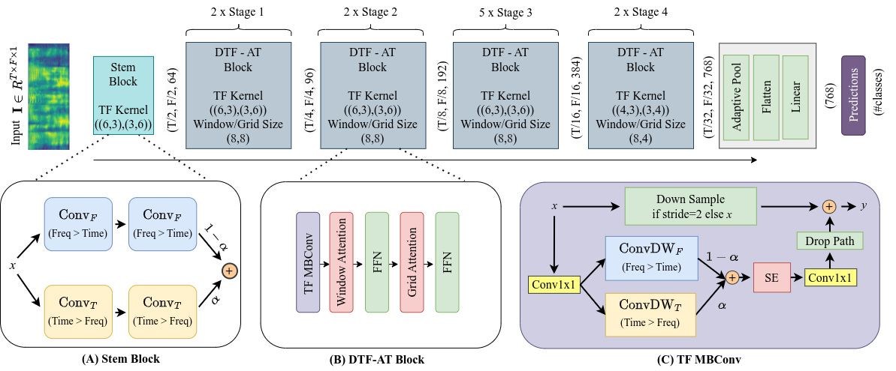
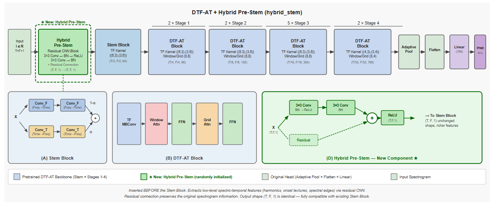
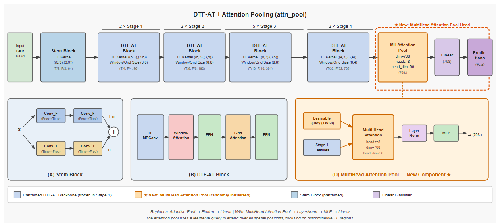
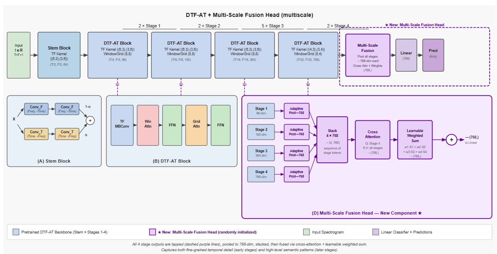
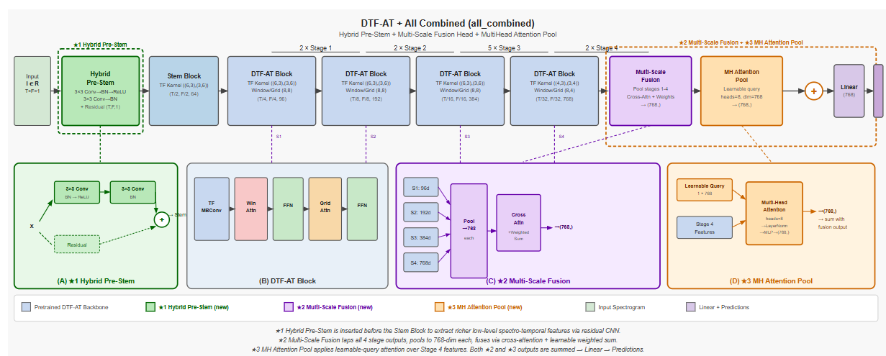
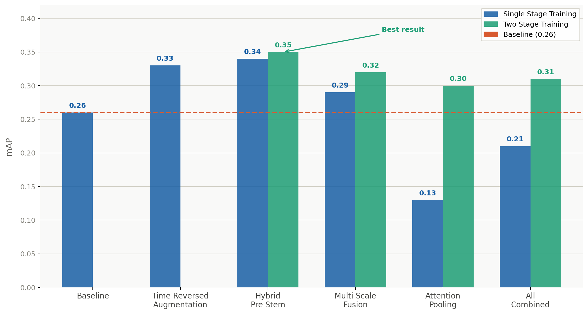

# Enhanced DTF-AT for Audio Event Classification

> Systematic enhancement of the Decoupled Time-Frequency Audio Transformer (DTF-AT) for large-scale audio event classification on AudioSet. This repository reproduces the DTF-AT baseline and evaluates four architectural enhancements, achieving a best result of **0.35 mAP** on the AudioSet balanced subset.

---

## Table of Contents

- [Overview](#overview)
- [Dataset](#dataset)
- [Architectures](#architectures)
  - [Original DTF-AT Baseline](#1-original-dtf-at-baseline)
  - [Hybrid Pre-Stem](#2-hybrid-pre-stem)
  - [Attention Pooling Head](#3-attention-pooling-head)
  - [Multi-Scale Fusion Head](#4-multi-scale-fusion-head)
  - [All Combined](#5-all-combined)
- [Ablation Study Results](#ablation-study-results)
- [File Structure](#file-structure)
- [Installation & Usage](#installation--usage)
- [References](#references)

---

## Overview

Audio event classification on large-scale datasets like AudioSet requires models that can jointly capture fine-grained spectral details and long-range temporal dependencies. The DTF-AT architecture addresses this through a decoupled time-frequency design. This project:

- Reproduces the DTF-AT baseline achieving **0.267 mAP** (paper reports 0.278 mAP) across 3 independent seeds
- Proposes and evaluates **4 architectural enhancements**
- Identifies a critical **gradient instability problem** when combining randomly initialized components with pretrained backbones
- Proposes and validates a **two-stage training strategy** that resolves this issue
- Achieves a best result of **0.35 mAP** with the Hybrid Pre-Stem under two-stage training

---

## Dataset

This project uses the **AudioSet Balanced Subset**, a large-scale multi-label audio classification benchmark.

| Split | Clips | Size |
|-------|-------|------|
| Train | 20,550 | ~12 GB |
| Eval  | 18,886 | ~10 GB |

- 527 audio event classes
- 10-second clips at 32 kHz
- Multi-label format (average 2-3 labels per clip)

### Dataset Links

| Resource | Link |
|----------|------|
| AudioSet (Baidu Pan) | [Download via Baidu Pan](https://pan.baidu.com/s/13WnzI1XDSvqXZQTS-Kqujg) |
| AudioSet (HuggingFace) | [yangwang825/audioset](https://huggingface.co/datasets/yangwang825/audioset) |
| Class Label Indices CSV | [class_labels_indices.csv](https://github.com/ta012/DTFAT/blob/master/egs/audioset/data/class_labels_indices.csv) |

---

## Architectures

All models process 10-second mono audio at 32 kHz. Input spectrograms are 1024 x 128 (time x frequency), compressed to a 32 x 4 encoder representation through the hierarchical DTF-AT encoder.

---

### 1. Original DTF-AT Baseline

The baseline DTF-AT architecture uses a specialized stem block that processes input spectrograms through **parallel time and frequency convolutional paths**, followed by four hierarchical stages of DTF-AT blocks in a **2-2-5-2 configuration**. Each block applies windowed local attention and grid-based global attention, enabling the model to capture both fine-grained local texture and long-range acoustic dependencies. The final representation is passed through adaptive pooling, flattening, and a linear classifier over 527 classes.



**Baseline Result:** 0.267 mAP (mean over 3 seeds: 0, 1, 2)

---

### 2. Hybrid Pre-Stem

A **residual convolutional block** is inserted before the standard transformer stem. This block applies two sequential 3x3 convolutions with batch normalization and ReLU activations, combined with a residual skip connection. The output shape is identical to the input (T, F, 1), making it fully compatible with the downstream pretrained stem block. Local convolutions are better suited for extracting low-level features such as harmonic textures, note onsets, and spectral edges compared to patch-based attention alone. The residual connection ensures the original spectrogram information passes through unchanged even before training stabilizes, protecting the pretrained backbone.



**Why it works:** The shape-preserving residual design causes zero disruption to the pretrained backbone, resulting in minimal gradient conflict and the strongest single-stage performance.

| Training Strategy | mAP |
|-------------------|-----|
| Single Stage | 0.34 |
| Two Stage (freeze 10 epochs) | **0.35** |

---

### 3. Attention Pooling Head

The standard adaptive pooling followed by flattening and linear classification is replaced with a **multi-head attention pooling layer**. A learnable query vector of dimension 768 attends over all spatial positions in the final 32 x 4 feature map from Stage 4 using multi-head attention with 8 heads and a head dimension of 96. The attended representation is then passed through layer normalization and an MLP before the linear classifier. This allows the model to dynamically focus on specific time-frequency regions most relevant for each prediction rather than treating all positions equally.



**Challenge:** The randomly initialized attention pooling head produced large unstable gradients in early training, corrupting the pretrained backbone before it could stabilize. Two-stage training was critical for this configuration.

| Training Strategy | mAP |
|-------------------|-----|
| Single Stage | 0.13 |
| Two Stage (freeze 10 epochs) | **0.30** |

---

### 4. Multi-Scale Fusion Head

Instead of using only the final Stage 4 representation, this head **taps intermediate representations from all four encoder stages**. Each stage output is projected to a unified 768-dimensional representation via adaptive pooling. A cross-attention mechanism uses the Stage 4 token as a query over all four stage tokens, allowing the final semantic representation to selectively attend to fine-grained information from earlier stages. A learnable weighted sum (w1·S1 + w2·S2 + w3·S3 + w4·S4) then combines all stage representations before the linear classifier.



**Design goal:** Blend low-level spectro-temporal details from early stages with high-level semantic patterns from the final stage for a richer classification signal.

| Training Strategy | mAP |
|-------------------|-----|
| Single Stage | 0.29 |
| Two Stage (freeze 10 epochs) | **0.32** |

---

### 5. All Combined

This configuration simultaneously integrates all three architectural modifications:

- **Hybrid Pre-Stem** at the input for richer low-level feature extraction
- **Multi-Scale Fusion Head** tapping all four stage outputs
- **MultiHead Attention Pooling** over Stage 4 features

The outputs of the Multi-Scale Fusion and Attention Pooling branches are **summed** before being passed to the linear classifier.



**Challenge:** Three randomly initialized components simultaneously fighting against the pretrained backbone made this the most severe case of gradient instability. The two-stage strategy recovered performance significantly.

| Training Strategy | mAP |
|-------------------|-----|
| Single Stage | 0.21 |
| Two Stage (freeze 10 epochs) | **0.31** |

---

## Ablation Study Results

The table below summarizes all configurations evaluated. Single-stage training trains all components jointly from the start. Two-stage training freezes the pretrained backbone for the first 10 epochs before full joint fine-tuning for the remaining 40 epochs.



| Configuration | Single Stage mAP | Two Stage mAP | Gain over Baseline |
|---------------|-----------------|---------------|-------------------|
| Baseline | 0.26 | NA | — |
| Time-Reversed Augmentation | 0.33 | NA | +0.07 |
| Hybrid Pre-Stem | 0.34 | **0.35** | +0.09 |
| Multi-Scale Fusion | 0.29 | 0.32 | +0.06 |
| Attention Pooling | 0.13 | 0.30 | +0.04 |
| All Combined | 0.21 | 0.31 | +0.05 |

### Key Findings

- **Time-Reversed Augmentation** delivered a 0.07 mAP gain with zero architectural changes, validating that temporal order matters less than spectral content for many audio events
- **Hybrid Pre-Stem** achieved the best overall result at 0.35 mAP, showing that enriching low-level features before the transformer stem is more effective than adding complexity at the head
- **Gradient instability** is the primary failure mode when combining randomly initialized components with pretrained backbones
- **Two-stage training** is essential for complex architectural variants, recovering the Attention Pooling Head from 0.13 to 0.30 mAP

---

## File Structure

```
Enhanced-DTFAT-for-Audio-Event-Classification/
|
|-- README.md                          <- This file
|-- original.png                       <- Baseline DTF-AT architecture diagram
|-- hybrid_stem.png                    <- Hybrid Pre-Stem architecture diagram
|-- attn_pool.png                      <- Attention Pooling architecture diagram
|-- multi_scale.png                    <- Multi-Scale Fusion architecture diagram
|-- all_combined.png                   <- All Combined architecture diagram
|-- ablation_study.png                 <- Ablation study results chart
|
|-- egs/
|   |-- audioset/
|       |-- data/                      <- Dataset metadata and label files
|       |-- 18885                      <- Evaluation file list
|       |-- train_run.sh               <- Shell script to launch training
|       |-- eval_run.sh                <- Shell script to launch evaluation
|
|-- src/
|   |-- audio_model_timm/
|   |   |-- models/
|   |   |   |-- layers/                <- Custom layer definitions
|   |   |   |-- test/                  <- Unit tests
|   |   |   |-- maxxvit.py             <- Original MaxViT model
|   |   |   |-- maxxvit_enhanced.py    <- Enhanced model with all modifications
|   |   |   |-- _builder.py            <- Model builder utilities
|   |   |   |-- _factory.py            <- Model factory
|   |   |   |-- _features.py           <- Feature extraction utilities
|   |   |   |-- _pretrained.py         <- Pretrained weight loading
|   |   |   |-- _registry.py           <- Model registry
|   |   |
|   |   |-- utilities/                 <- General utility functions
|   |
|   |-- dataloader.py                  <- Original data loading pipeline
|   |-- dataloader_enhanced.py         <- Enhanced dataloader with Time-Reversed Aug
|   |-- dataset_viz.py                 <- Dataset visualization and EDA scripts
|   |-- dtfat.yml                      <- Conda environment configuration
|   |-- eval.py                        <- Evaluation script
|   |-- plot_results.py                <- Script to generate result plots
|   |-- run.py                         <- Main training runner
|   |-- the_new_audio_model.py         <- Original DTF-AT model wrapper
|   |-- the_new_audio_model_enhanced.py <- Enhanced model wrapper
|   |-- traintest.py                   <- Training and testing loop
|   |-- temp.md                        <- Temporary notes
|
|-- data_viz/                          <- Dataset analysis and EDA outputs
|   |-- (label cardinality plots, Jaccard heatmaps, encoder visualizations)
|
|-- experiments_plots_only/
    |-- experiments_plots_only/        <- All experiment result plots
        |-- (training curves, LR schedules, loss curves per configuration)
```

---

## Installation & Usage

### 1. Clone the repository

```bash
git clone https://github.com/pvbgeek/Enhanced-DTFAT-for-Audio-Event-Classification.git
cd Enhanced-DTFAT-for-Audio-Event-Classification
```

### 2. Set up the environment

```bash
conda env create -f src/dtfat.yml
conda activate dtfat
```

### 3. Prepare the dataset

Download the AudioSet balanced subset using one of the dataset links above and place the files under `egs/audioset/data/`.

### 4. Train

```bash
cd egs/audioset
bash train_run.sh
```

### 5. Evaluate

```bash
cd egs/audioset
bash eval_run.sh
```

---

## References

1. Alex, T., Ahmed, S., Mustafa, A., Awais, M., and Jackson, P. J. (2024). DTF-AT: Decoupled Time-Frequency Audio Transformer for Event Classification. AAAI 2024. [Paper](https://ojs.aaai.org/index.php/AAAI/article/view/29716) | [GitHub](https://github.com/ta012/DTFAT)

2. Gemmeke, J. F., Ellis, D. P. W., et al. (2017). Audio Set: An ontology and human-labeled dataset for audio events. IEEE ICASSP 2017.

3. Gong, Y., Chung, Y. A., and Glass, J. (2021). AST: Audio Spectrogram Transformer. Interspeech 2021. [GitHub](https://github.com/YuanGongND/ast.git)

4. Kong, Q., et al. (2020). PANNs: Large-Scale Pretrained Audio Neural Networks for Audio Pattern Recognition. IEEE/ACM TASLP.

5. Liu, Z., et al. (2021). Swin Transformer: Hierarchical Vision Transformer Using Shifted Windows. ICCV 2021.

6. Tu, Z., et al. (2022). MaxViT: Multi-Axis Vision Transformer. ECCV 2022.

7. Loshchilov, I. and Hutter, F. (2019). Decoupled Weight Decay Regularization. ICLR 2019.

---

<p align="center">
  Made with care for COEN 342 Deep Learning — Santa Clara University
</p>
